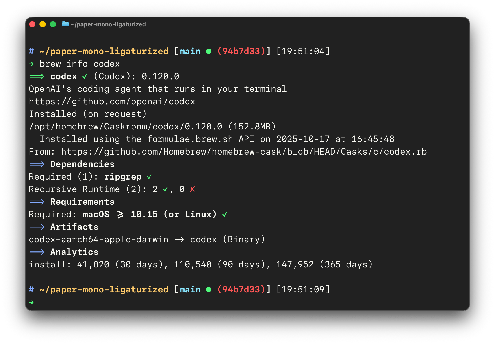

# Paper Mono Ligaturized

Paper Mono patched with Fira Code ligatures via Ligaturizer.



## Setup

Install the ligaturized fonts from `fonts/` using your OS font manager.

Paper Mono currently ships eight upright weights and no italic styles, so this
repo generates these variants:

- `LigaPaperMono-Thin.otf`
- `LigaPaperMono-ExtraLight.otf`
- `LigaPaperMono-Light.otf`
- `LigaPaperMono-Regular.otf`
- `LigaPaperMono-Medium.otf`
- `LigaPaperMono-SemiBold.otf`
- `LigaPaperMono-Bold.otf`
- `LigaPaperMono-ExtraBold.otf`

### VS Code

In VS Code, press `Cmd` + `Shift` + `P`, search for
`Preferences: Open User Settings (JSON)`. In the opened `settings.json`,
set font family to `Liga Paper Mono` and enable ligatures:

```json
"editor.fontFamily": "'Liga Paper Mono', monospace",
"editor.fontLigatures": "'calt', 'liga'",
"terminal.integrated.fontFamily": "'Liga Paper Mono', monospace",
"terminal.integrated.fontLigatures.enabled": true,
```

### Ghostty

Open Ghostty settings (`Cmd` + `,`) and set font family to `Liga Paper Mono`:

```ini
font-family = Liga Paper Mono
```

Press `Cmd` + `Shift` + `,` to reload the terminal with the new configuration.

## Build

Run `make build` in the repository root on macOS with git and Homebrew.

The Makefile will:

- Reuse local `paper-mono/` and `Ligaturizer/` clones when present, or clone
  `paper-mono` from the `light-master` branch plus Ligaturizer when missing.
- Initialize only the `fonts/fira` submodule inside Ligaturizer.
- Stage the eight Paper Mono `otf` files from `paper-mono/fonts/otf/` into
  `Ligaturizer/fonts/paper-mono/`.
- Patch Ligaturizer so `renamed_fonts` emits the `Liga Paper Mono` family for
  every Paper Mono weight.
- Remove the same ligatures that were excluded in the DM Mono version.
- Run the Ligaturizer build and copy the ligaturized `otf` files into `fonts/`.

Run `make` to perform the same build and then remove `paper-mono/` and
`Ligaturizer/` afterward. Run `make clean` to remove both cloned sources and
generated fonts.

### Dropped ligatures

These ligatures from Fira Code are intentionally omitted:

`&&`, `~@`, `\/`, `.?`, `?:`, `?=`, `?.`, `??`, `;;`, `/\`
